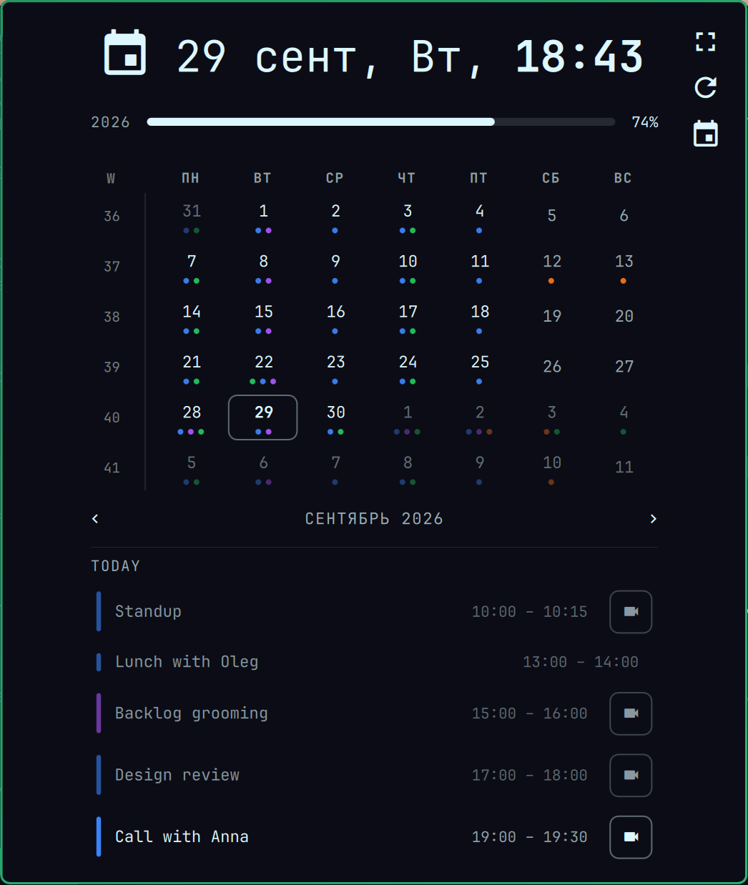
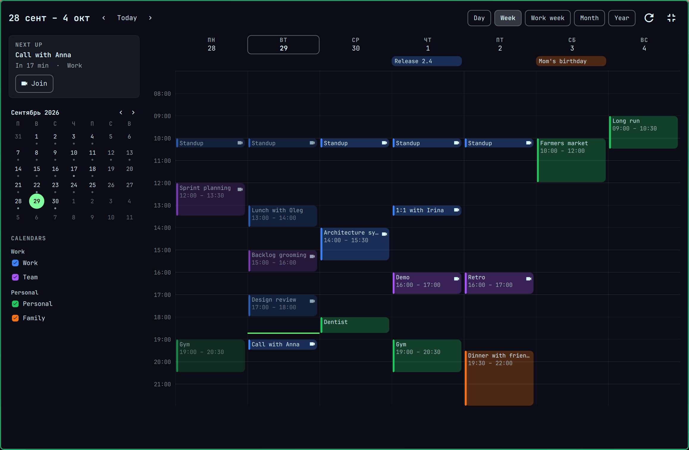
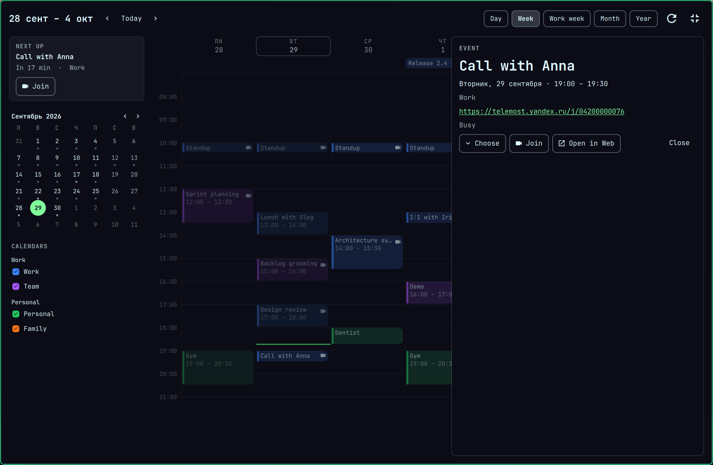
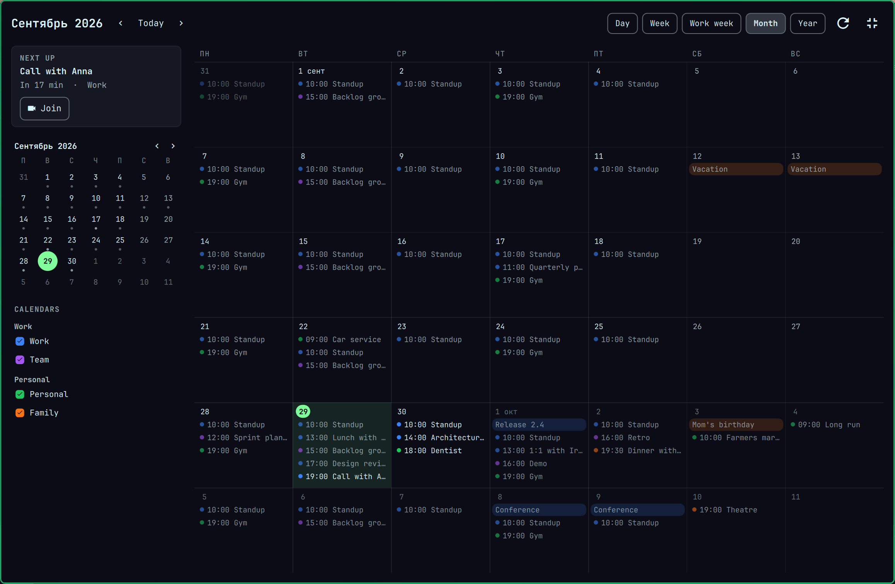

# Datebook Calendar for Omarchy

Based on [Datebook](https://github.com/jonspinks/omarchy-calendar).

A calendar in Omarchy's top bar for looking, not editing. Click the date and
you see today's meetings with a Join button for each. Expand it for a week,
month or year of Yandex, Google and any CalDAV calendars.



It never creates, changes or deletes events. The only thing it writes back
is your answer to an invitation.

## Install

```bash
git clone https://github.com/predmaxim/omarchy-datebook-calendar.git \
  ~/.config/omarchy/plugins/predmaxim.datebook
omarchy plugin enable predmaxim.datebook --before omarchy.clock
omarchy plugin disable omarchy.clock
```

## Connect a calendar

```bash
C=~/.config/omarchy/plugins/predmaxim.datebook/scripts/calendar-ctl

$C add-yandex Work you@example.ru                        # asks for an app password
$C add-caldav Home https://dav.example.org/ you [email]  # any CalDAV server
$C add-google Personal ~/Downloads/client_secret_*.json  # your own OAuth client
$C sync
```

- **Yandex:** make an app password at id.yandex.ru → Security → App passwords
  → Calendar.
- **Google:** in the Google Cloud Console create a project, turn on the
  Google Calendar API, set up the consent screen with the scope
  `https://www.googleapis.com/auth/calendar` (answering an invitation is a
  write), publish it *In production*, then create an OAuth client of type
  *Desktop app* and download its JSON.

## What's inside

**Week, month, year.** The expand button opens the big view: day, week, work
week, month and year, with calendars to tick on the left and the next meeting
at the top.



**Event card.** Click an event to see its time, calendar, place and links.
From the card you can join, open the event on the web, or answer an
invitation (for a recurring one, the answer covers the whole series).



**Reminders** pop up before a meeting; click one to join, or snooze it.

**Language.** Buttons follow the system language (`LC_MESSAGES`, English or
Russian), dates follow `LC_TIME`. The screenshots use English text with
Russian dates.



## Controls

| | |
|---|---|
| `1`–`5` | day, week, work week, month, year |
| `[` `]`, arrows | previous / next |
| `t` | today |
| `w` | first day of the week |
| `m` | ⋮ menu (↑/↓, Enter, Esc closes the menu) |
| Esc, Enter | close the event card |

Sync runs every 3 minutes and when you open the calendar; `calendar-ctl sync`
runs it by hand. `calendar-ctl choose` picks calendars from the terminal;
hidden calendars aren't downloaded.

Optional settings in the widget's entry in `shell.json`: `"format"` (the date
on the bar; 12/24-hour carries into the calendar), `"view"`,
`"layout": "classic"`, `"reminders": false`.

From scripts: `qs ipc -p /usr/share/omarchy/shell call predmaxim.datebook <cmd>`,
where `<cmd>` is `toggle`, `compact`, `expand`, `view week` or `showEvent <uid>`.

## Your data

Everything stays on your computer; there's no server behind this plugin.
Passwords and tokens are kept in the system keyring. The account list lives in
`~/.config/predmaxim.datebook/`, a copy of your events in
`~/.cache/predmaxim.datebook/`, and both are readable only by you. Google access
can be revoked at myaccount.google.com/permissions; for Yandex, delete the app
password.

## Remove

```bash
C=~/.config/omarchy/plugins/predmaxim.datebook/scripts/calendar-ctl
$C list && $C remove Work            # for each account: drops its keyring entry
omarchy plugin remove predmaxim.datebook
omarchy plugin enable omarchy.clock --section center
rm -rf ~/.config/predmaxim.datebook ~/.cache/predmaxim.datebook
```

## Notes

- Yandex sends recurring meetings as rules and doesn't expand them itself, so
  the plugin expands daily and weekly series on its own. Other rules show only
  their moved or edited occurrences. Yandex doesn't send its reminders over
  CalDAV.
- Code: `scripts/omcal/` syncs (`caldav.py`, `ical.py`, `google.py`) into
  `~/.cache/predmaxim.datebook/events.json`, which the QML widget reads.
  Tests: `tests/run.sh`.

## License

MIT, see [LICENSE](LICENSE). Parts of the panel come from Omarchy's own clock.
